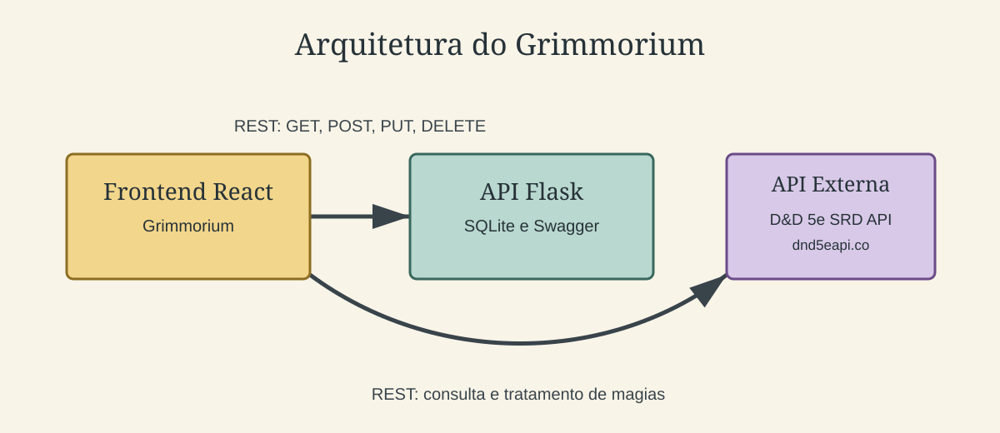

# 🛡️ Grimmorium Frontend

Uma SPA (Single Page Application) em React para gerenciamento de personagens em tempo real.

Este repositório contém a **interface visual** do ecossistema Grimmorium. Ele se conecta diretamente ao nosso ecossistema de backend para fornecer uma experiência fluida e dinâmica de gerenciamento de fichas, magias e inventários.

> 🌐 **Repositório Backend:** Para o funcionamento completo com persistência de dados, certifique-se de que o backend está ativo. Você encontra as instruções no [repositório do backend](https://github.com/leonardoccamargo/grimmorium-react-backend).

---

## 🏗️ Arquitetura

O Grimmorium adota o cenário de interface, API própria e serviço externo. A interface consome o backend Flask para gerir personagens e magias persistidas em SQLite. Ela também consulta e trata dados da API pública D&D 5e SRD diretamente no Grimório, sem redirecionar o usuário para outro sistema.



---

## 🛠️ Pré-requisitos

1. **Docker Desktop:** instalado e em execução ([instalação](https://docs.docker.com/desktop/install/windows-install/)).
2. Os repositórios `grimmorium-react` e `grimmorium-react-backend` devem estar clonados lado a lado.

---

## 🐳 Execução com Docker

No PowerShell, na raiz deste repositório, execute:

```powershell
docker compose up --build
```

O Docker inicia os dois componentes: interface em [http://localhost:8080](http://localhost:8080), API em [http://localhost:5000](http://localhost:5000) e Swagger em [http://localhost:5000/openapi/swagger](http://localhost:5000/openapi/swagger). Para encerrar, pressione `Ctrl + C` ou execute `docker compose down` em outro terminal.

---

## 💻 Execução local (alternativa para desenvolvimento)

Para executar sem Docker, instale Node.js 18+ e mantenha o backend disponível em `http://127.0.0.1:5000`:

```powershell
npm install
npm run dev
```

Acesse [http://localhost:5173](http://localhost:5173). Para interromper, pressione `Ctrl + C` no terminal.

---

## 📍 Rotas Principais

A aplicação utiliza roteamento interno para as seguintes telas:

* `/` — Página inicial / Dashboard.
* `/personagens` — Listagem e gerenciamento de personagens.
* `/grimorio` — Consulta e gerenciamento de magias.
* `/jogar` — Área de jogo/sessão.
* `/jogar/:id` — Tela de jogo focada em um personagem específico.
* `*` — Tela de erro (404) para rotas não encontradas.

---

## 🔄 Dados e Integração (Modos de Funcionamento)

A aplicação suporta funcionamento híbrido. Caso precise usar o frontend de forma isolada sem o backend ativo, você pode consumir dados de um arquivo **JSON local**:

1. **Ativar Modo Local:** No seu arquivo `.env.development`, altere o valor da variável:
```env
VITE_CHARACTERS_DATA_MODE=local

```


2. **Voltar para a API (Backend):** Altere a mesma variável de volta para:
```env
VITE_CHARACTERS_DATA_MODE=api

```


3. **Mudar endereço da API:** Se o seu backend estiver rodando em outra porta ou servidor, ajuste a variável:
```env
VITE_API_BASE_URL=[URL_DO_SEU_NOVO_BACKEND]

```


> ⚠️ **Nota sobre Magias:** Mesmo em modo local, as magias continuam sendo buscadas no endpoint `/api/magias`.

---

## 🧰 Comandos Úteis

No diretório do projeto, você pode executar os seguintes scripts:

* `npm run dev` — Inicia o servidor de desenvolvimento local.
* `npm run build` — Compila a aplicação para produção (gera os arquivos otimizados na pasta `dist`).
* `npm run preview` — Visualiza localmente o build de produção gerado.
* `npm run lint` — Executa o linter para buscar e corrigir problemas no código estrutural.

---

## 🎖️ Créditos

### API externa: D&D 5e SRD API

* Serviço público e gratuito: [D&D 5e SRD API](https://www.dnd5eapi.co), sem cadastro ou chave de API.
* Rotas usadas: `GET /api/2014/spells` para o índice e `GET /api/2014/spells/{index}` para os detalhes de cada magia.
* A aplicação transforma a resposta externa em cards e detalhes de magia dentro do Grimório; o usuário permanece na interface Grimmorium.
* O conteúdo SRD utilizado como base é disponibilizado sob a licença [CC-BY-4.0](https://creativecommons.org/licenses/by/4.0/), com a atribuição indicada pela Wizards of the Coast. A API é referenciada como o serviço externo utilizado pelo projeto.
